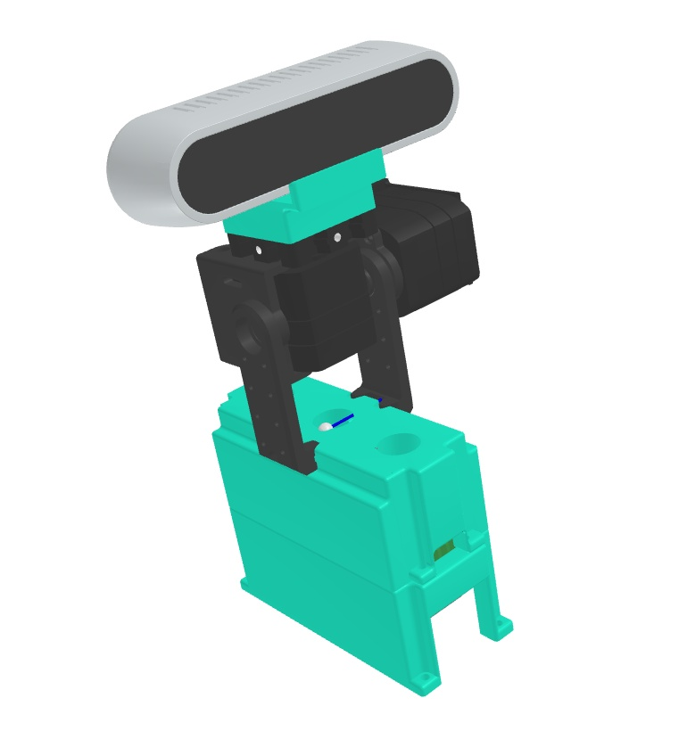

# URDF Mesh Converter

This package leverages the URDF Exporter plugin for SolidWorks to generate colored `.dae` models from `.3dxml` files.

JSK users should refer to the URDF Exporter documentation for [guidance](https://docs.google.com/presentation/d/1c2fdw6f_ny4jizH5VS3M7yLNd60M3rzsZs-ACR1ghNI).


## Quick Start
After building this package, source your workspace. Then, simply execute the command below, specifying your .3dxml URDF file path and the desired output URDF path.

```
rosrun urdf_mesh_converter convert_urdf_mesh.py <YOUR_URDF_PATH> --output <OUTPUT_URDF_PATH>
```

For a practical example, you can apply this package to an actual URDF by running the following command:

```
rosrun urdf_mesh_converter convert_urdf_mesh.py $(rospack find urdf_mesh_converter)/samples/pitch_yaw_2axis_camera_module.urdf --output $(rospack find urdf_mesh_converter)/samples/pitch_yaw_2axis_camera_module_modified.urdf
```


